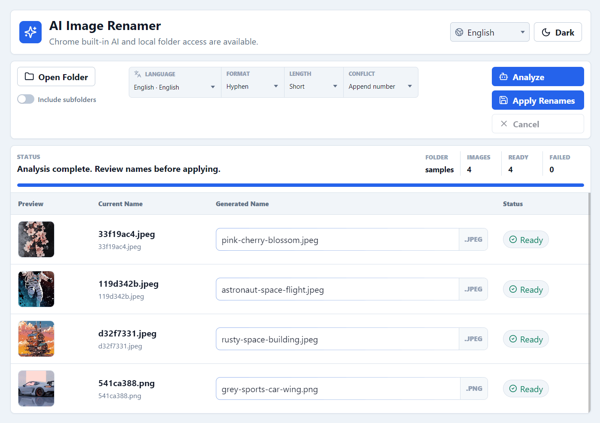
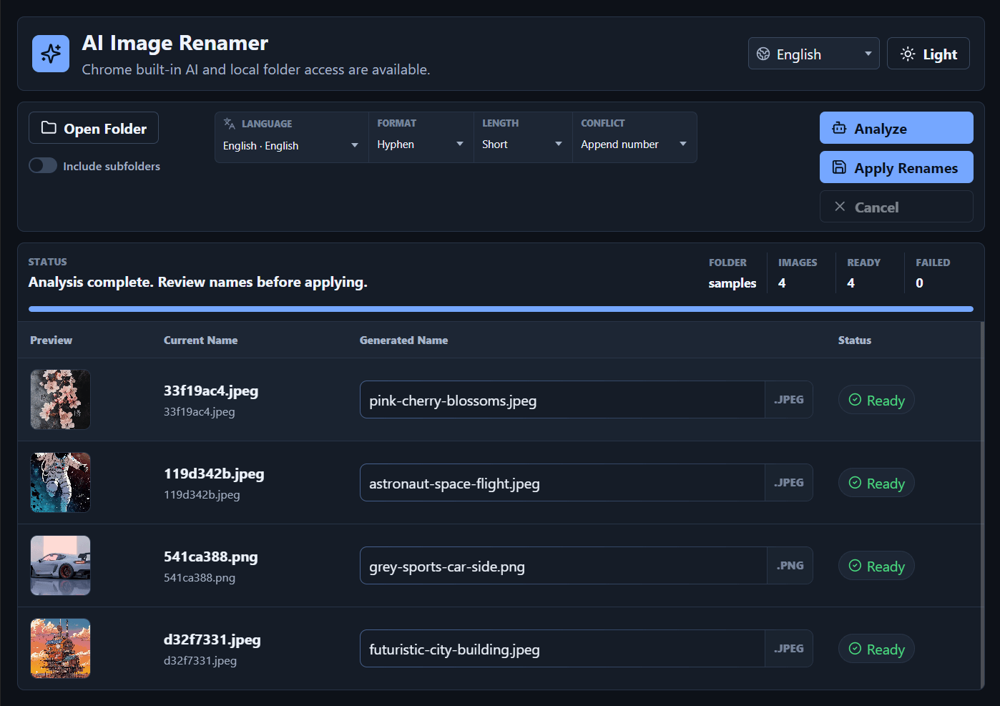

# AI Image Renamer

Rename local image files in Chrome using built-in AI and the File System Access API.

AI Image Renamer is a React/Vite web app for batch-renaming image folders from visual content. It scans local images, asks Chrome's built-in AI model for a concise description, generates filenames from that description, and lets us review or edit every name before applying changes.



## About

The app is designed for local photo and asset cleanup. It runs in the browser, uses Chrome's local file APIs for folder access, and keeps files on the user's machine. There is no account system, upload workflow, backend service, or external model API key.

Use it when camera-generated names like `IMG_2048.jpeg` or `DSC_1182.png` need to become searchable names such as `sunlit-mountain-lake.jpeg`.

## Capabilities

- Open a local image folder from the browser.
- Include or exclude subfolders during scanning.
- Analyze image content with Chrome built-in AI.
- Generate filenames in English, German, Japanese, French, Spanish, Simplified Chinese, or Traditional Chinese.
- Choose filename format, name length, and conflict handling.
- Review, edit, skip, or apply generated names.
- Rename files in place through the File System Access API.
- Switch between light and dark themes.
- Install the app as a PWA with a manifest, app icons, and service worker caching.
- Serve SEO landing pages for supported locales.

## Screenshots

Light theme:


Dark theme:



## Non-Goals

- The app does not upload images to a server.
- The app does not provide cloud sync, storage, or user accounts.
- The app does not guarantee perfect AI descriptions.
- The app does not replace a backup workflow. Keep a backup or test on a copied folder before running large renames.

## Requirements

- Chrome with built-in AI Prompt API image input support.
- File System Access API support.
- Direct file rename support through `FileSystemFileHandle.move`.
- Node.js 22+ for local development.
- pnpm 10.26.0.

> [!NOTE]
> Browser support depends on Chrome's built-in AI implementation and enabled flags. If Chrome reports that image input is unavailable, the app shows a support checklist instead of the renaming workspace.

## Getting Started

Install dependencies:

```powershell
cd D:\Side\ai-image-renamer
pnpm install
```

Run the development server:

```powershell
pnpm dev
```

Open:

```text
http://127.0.0.1:5177
```

## Usage

1. Open `/app/`.
2. Click `Open Folder`.
3. Toggle `Include subfolders` if the scan should recurse through nested folders.
4. Pick an output language.
5. Choose filename format, name length, and conflict strategy.
6. Click `Analyze`.
7. Review or edit generated names.
8. Click `Apply Renames`.

Use the `Home` button in the app header to return to the landing page. Use the `Dark` / `Light` button to switch themes. The theme and UI language are saved in local storage.

## Build

Create a production build:

```powershell
pnpm build
```

The build runs Vite, `scripts/prerender.mjs`, and `scripts/generate-sw.mjs`. The prerender step emits static landing and legal pages for:

- `/`
- `/de/`
- `/ja/`
- `/fr/`
- `/es/`
- `/zh/`
- `/zh-TW/`
- matching `/terms/` and `/privacy/` pages
- `/app/` for the interactive app

The final service worker is generated after prerendering so the PWA precache includes the app route, localized landing pages, legal pages, screenshots, icons, and hashed Vite assets.

Set the public site URL before building so canonical and Open Graph URLs use the deployment domain:

```powershell
$env:SITE_URL="https://your-domain.com"; pnpm build
```

Preview the production build:

```powershell
pnpm preview
```

## Project Structure

```text
.
|-- index.html
|-- public/
|   |-- screenshot-dark.png
|   `-- screenshot-light.png
|-- scripts/
|   `-- prerender.mjs
|-- src/
|   |-- components/
|   |-- data/
|   |-- utils/
|   |-- main.jsx
|   `-- styles.css
|-- package.json
|-- pnpm-lock.yaml
`-- vite.config.js
```

## Architecture

The app uses a single React entry point in `src/main.jsx`. Routing is handled in the browser with `history.pushState`, with three main surfaces:

- `LandingPage` for localized marketing and product explanation.
- `LegalPage` for localized terms and privacy content.
- `RenamerApp` for folder access, AI analysis, review, and rename operations.

Shared text lives in `src/data/constants.js`. File validation, AI prompting, conflict handling, and rename helpers live in `src/utils/fileRenamer.js`. Reusable controls live in `src/components/ui.jsx`.

The production HTML is generated in two phases:

1. Vite builds the React app and hashed assets into `dist/`.
2. `scripts/prerender.mjs` rewrites `dist/index.html` into localized static pages while preserving Vite's generated JS and CSS asset tags.

## Trade-Offs and Constraints

- Chrome built-in AI availability varies by browser version, enabled flags, installed model, and language support.
- AI-generated filenames need review. The app keeps review in the workflow because visual descriptions can be wrong or too generic.
- Direct file renaming is browser-dependent. Unsupported browsers show a capability checklist instead of partial functionality.
- Local processing improves privacy because images stay on the device, but it also means performance depends on the local browser and model.

## Development Notes

- Keep `pnpm-lock.yaml` as the single dependency lockfile.
- Do not commit `dist/`, `node_modules/`, local logs, or environment files.
- Add new UI text through `src/data/constants.js` so localized pages and the app stay aligned.
- Run `pnpm build` after changing prerendering, routing, or asset handling.
- Keep PWA icons in `public/` and update `vite.config.js` when adding new required sizes.
